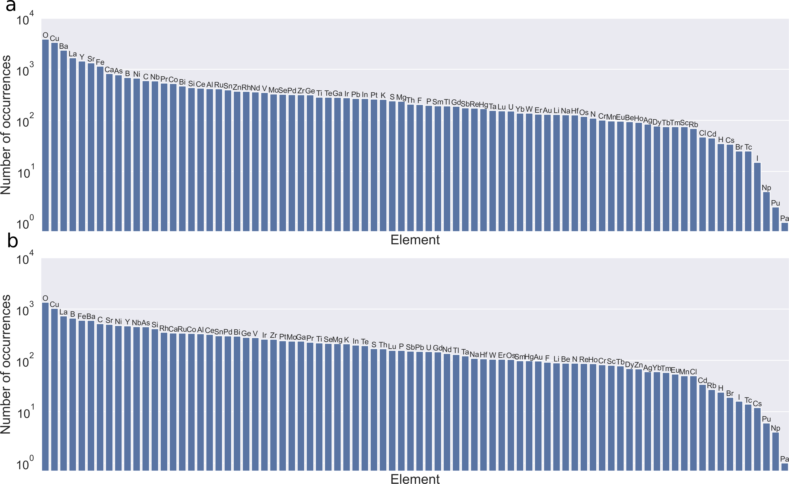
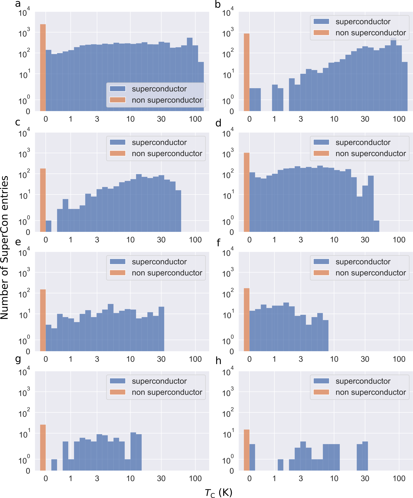
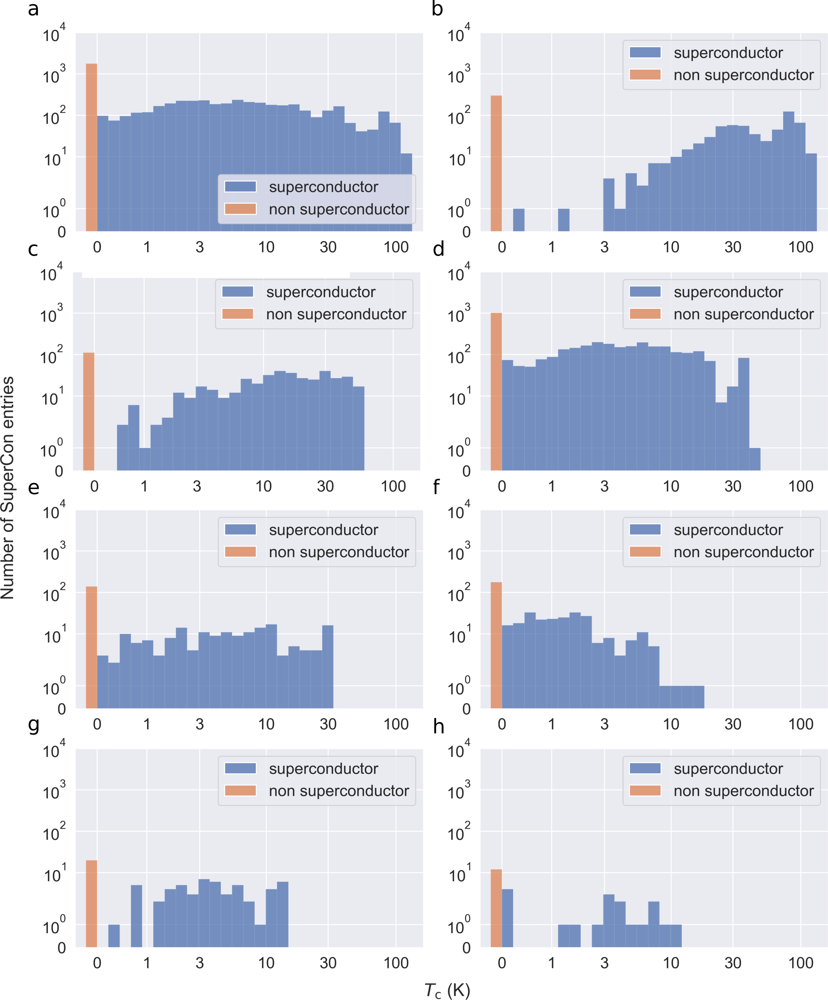

# Dataset statistics
This file contains dataset statistics for the 3DSC that didn't fit into the SI of the paper. They might be interesting to get a feeling for the content of the 3DSC.

Figure 1 shows elemental prevalence plots, showing how often each chemical element occurs in the 3DSC dataset. 
Figure 2 (3DSCICSD) and 3 (3DSCMP) show histograms of the number of SuperCon entries with given critical temperature *T*c, both for the full dataset and for each of the superconductor groups mentioned in the paper: cuprates, ferrites, oxide, heavy fermion materials, Chevrel phases, carbon based materials and others.

  
  <em>Figure 1: Elemental prevalence plots, showing how often each chemical element occurs in the 3DSCICSD (a) and the 3DSCMP (b).</em>

  
  <em> Figure 2: The number of SuperCon entries with given critical temperature Tc for the full 3DSCICSD (a) and for each superconductor group ((b) to (h)): cuprates (b), ferrites (c), other (d), oxide (e), heavy fermion materials (f), Chevrel phases (g), carbon based materials (h). The non-superconductors are shown in orange. The left-most blue bar includes only superconductors with Tc > 0 K.</em>

  
  <em> Figure 3: The number of SuperCon entries with given critical temperature Tc for the full 3DSCMP (a) and for each superconductor group ((b) to (h)): cuprates (b), ferrites (c), other (d), oxide (e), heavy fermion materials (f), Chevrel phases (g), carbon based materials (h). The non-superconductors are shown in orange. The left-most blue bar includes only superconductors with Tc > 0 K.</em>

