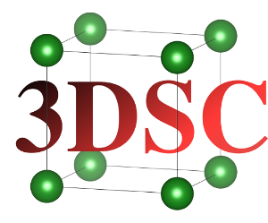

<p align="center">
  
</p>

# The 3DSC database
This repository contains data and code of the 3DSC database, the first extensive database of superconductors with their critical temperature *T*<sub>c</sub> and their three-dimensional crystal structure. We describe the database and the algorithm to generate it in our paper https://arxiv.org/abs/2212.06071.


## Using the 3DSC database

The 3DSC database can be found on figshare under https://doi.org/10.6084/m9.figshare.c.6914407.v1. The zip file can be extracted via the command `tar -xzvf 3DSC_MP.tar.gz`.

Alternatively, the 3DSC<sub>MP</sub> database can be found under `superconductors_3D/data/final/MP`. The file `3DSC_MP.csv` contains the 3DSC<sub>MP</sub> in tabular form. The three most important columns are the following:

- `formula_sc`: The chemical formula of the material, which is exactly the original chemical formula of the SuperCon entry. Note that due to the normalization of chemical formulas in the matching algorithm, this chemical formula might deviate by a constant factor from the chemical formula of the primitive unit cell of the structure.
- `tc`: The critical temperature in Kelvin. Non-superconductors have a *T*<sub>c</sub> of 0.
- `cif`: The path to the cif file of the 3DSC<sub>MP</sub> crystal structure relative to the directory `3DSC/superconductors_3D/`. If the name contains `synth_doped` this means that this structure was artificially doped.

Additionally to these three basic columns of the 3DSC<sub>MP</sub> database, there are a lot of columns which were important in the matching and adaptation algorithm, which are from the original Materials Project database or which were important for the analysis in our paper. These columns are less important if you just want to use the 3DSC<sub>MP</sub>, but they might be interesting for everyone looking to improve the 3DSC<sub>MP</sub> or reproduce the results in our paper.

- `MAGPIE.*`: MAGPIE feature vectors of the chemical formula of this material. Missing in the github version (see note below).
- `SOAP.*`: DSOAP feature vectors of the structure. Missing in the github version (see note below).
- `.*_2`: All columns ending with `_2` are the columns from the original structure from the Materials Project or columns added in the process of cleaning the initial Materials Project database.
- `totreldiff`: The $\Delta_\mathrm{totrel}$ from our paper[1], a measure of the difference between the original chemical formula of the SuperCon and of the Materials Project.
- `formula_frac`: The normalization factor of the chemical formulas.
- `sc_class`: The superconductor group (either 'Other', 'Heavy_fermion', 'Chevrel', 'Oxide', 'Cuprate', 'Ferrite', 'Carbon'). Some of the entries also have 'OxideHeavy_fermion' or 'Heavy_fermionChevrel', which means that the algorithm could not uniquely attribute this material into one group.
- `weight`: The sample weight which was used for the XGB model and the calculcation of the scores. This is just the inverse of the number of crystal structures per SuperCon entry in the database.
- `cif_before_synthetic_doping`: The path to the original cif file of the Materials Project before artificial doping.
- `crystal_temp_2`: The crystal temperature. Non-zero only for the 3DSC<sub>ICSD</sub>.
- `no_crystal_temp_given_2`: If the crystal temperature was not explicitly given. Always True in the 3DSC<sub>MP</sub>. In the 3DSC<sub>ICSD</sub>, this is True if no crystal temperature was given and 293K was assumed.
- `cubic`, `hexagonal`, `monoclinic`, `orthorhombic`, `tetragonal`, `triclinic`, `trigonal`, `primitive`, `base-centered`, `body-centered`, `face-centered`: The symmetry features as described in the supporting information of our paper.

Note that in the github version of this dataset, we have removed the `SOAP.*` and the `MAGPIE.*` columns due to memory constraints. You can get these columns by executing the matching and adaptation algorithm as described below.


### How to cite the 3DSC
Please cite our paper as given in [1].


## Reproducing the 3DSC paper


### Prerequisites

This code was developed and tested with and for Linux. Most likely it will throw errors for other OS. To install the Python packages we used conda 4.13.0 and git 2.38.1. Please ensure conda and git are installed on your system.


### Installation


1. Download the 3DSC repository into the current directory
   ```sh
   git clone https://github.com/aimat-lab/3DSC.git
   ```
2. Change into this directory
   ```sh
   cd 3DSC
   ```
3. Setup the conda environment with name 3DSC. First, check your ~.condarc file and temporarily set
   ```sh
   channel_priority: false
   ```
   After installing the conda environment you can set this parameter back to its previous value. 
   Note: If you have a very old conda version < 4.6.0, this parameter might throw errors for you, in this case try to leave it out. 
4. Now read in the provided conda environment file to generate the correct conda environment:
   ```sh
   conda env create -f ./environment.yaml --name 3DSC
   ```
   Note: It is important that this is done once for each directory in which this repo will be installed. If you clone the repo into another local directory, do this step again, don't skip it. The conda environment will be linked to the absolute path to the cloned version of this repo.
5. Activate the conda environment:
   ```sh
   conda activate 3DSC
   ```

   
### Reproduction
In the following we will describe the exact steps to reproduce most of the paper: The generation of the 3DSC<sub>MP</sub>, most of the statistical plots shown in the paper and the most important machine learning results. If you want to automatically perform all of these steps please run
```sh
python superconductors_3D/run_everything.py -d MP -n N_CPUS
```
Please replace N_CPUS with the number of cores that you want to use in parallel, e.g. `1`. The flag `-d MP` means that we create the 3DSC using crystal structures from the Materials Project. For memory reasons it is recommended to use only one core on a laptop.

If you want to use the crystal structures from the ICSD you need to change this flag to `-d ICSD`. For how to deal with the 3DSC<sub>ICSD</sub>, please see section [The 3DSC<sub>ICSD</sub>](#the-3dscicsd).

If you want to see the github repo in the state that it was for publication, please use 
```sh
git checkout 2471dd51a298a854cb4f365ebd39e72c7cbf3634
```


#### Generating the 3DSC dataset
To generate the 3DSC dataset, run the command
```sh
python superconductors_3D/generate_3DSC.py -d MP -n N_CPUS
```
The script `generate_3DSC.py` automatically runs through all stages of the matching and adaptation algorithm described in the paper: In step 0-2, the cif files, the Materials Project database and the SuperCon database are cleaned. In step 3, the SuperCon entries and the crystal structures are matched based on their chemical composition. In step 4, artificial doping is performed for all matches where the relative chemical formula doesn't match perfectly. In step 5, the chemical composition and the three-dimensional crystal structure are featurized using the MAGPIE and the Disordered SOAP algorithm. The latter is an extension of the SOAP algorithm which is described in the SI of our paper. Finally, matches are ranked and only the best matches are kept. Note that in general multiple matches can be ranked equally and will all end up in the final 3DSC dataset.
The intermediate data will be saved under `superconductors_3D/data/intermediate/MP` and the final data will be saved under `superconductors_3D/data/final/MP`. Running this command with 1 core needs about 0.5h.


#### Statistical plots
To generate the statistical plots shown in the paper please run the command
```sh
python superconductors_3D/plot_dataset_statistics.py -d MP
```
The results will be saved under `results/dataset_statistics/SC_MP_matches`. Running this command with 1 core needs few minutes.


#### Machine learning results
To reproduce the most important machine learning results shown in the paper please run the command
```sh
python superconductors_3D/train_ML_models.py
```
The results will be saved under `results/machine_learning`.

Warning: Please note that because we removed the `SOAP` and `MAGPIE` columns from the github version of the 3DSC<sub>MP</sub>, you need to first run the command above to generate the 3DSC<sub>MP</sub> before running this command. Additionally, please note that this command needs a couple of hours and several GB of disc space to run, because per default it trains 100 models (and 25 for the 3DSC<sub>ICSD</sub>) for 10 different train fractions in order to reproduce the results of the paper. If you want to modify these numbers you should be able to quickly identify them in the source code.


#### The 3DSC<sub>ICSD</sub>
Above we have focused on the 3DSC<sub>MP</sub> which is based on freely accessible crystal structures from the Materials Project database[4]. We have also created another 3DSC database, based on crystal structures from the ICSD, the 3DSC<sub>ICSD</sub>. However, because the crystal structures from the ICSD are not available freely, we cannot provide the source files here. Instead, we provide the 3DSC<sub>ICSD</sub> only with the ICSD IDs of the original matched crystal structures. *Note that many of the crystal structures in the 3DSC<sub>ICSD</sub> are artificially doped by our algorithm and therefore differ from the original ICSD structure with this ID.*

The original ICSD IDs can be found under `superconductors_3D/data/final/ICSD/3DSC_ICSD_only_IDs.csv`. The ICSD ID can be found in the column `database_id_2` and is prepended by 'ICSD-'. Note that this is the ICSD ID from the API, not from the website, therefore you cannot find the corresponding structure by searching for the ID on the ICSD website.

If you have access to the ICSD, you can download it and run it through the matching and adaptation algorithm yourself.


## License
The 3DSC<sub>MP</sub> database is subject to the Creative Commons Attribution 4.0 License, implying that the content may be copied, distributed, transmitted, and adapted, without obtaining specific permission from the repository owner, provided proper attribution is given to the repository owner. All software in this repository is subject to the MIT license. See `LICENSE.md` for more information.


## Origin of data

We are grateful to the provider of different databases which have made the 3DSC possible:

- The superconductor data is freely accessible provided by Stanev et al.[2] under a CC BY 4.0 license. This data is a subset of the SuperCon database, which originally was accessible at [3] and has recently been moved to [6] under a CC BY 4.0 license.
- The crystal structures as input for the 3DSC<sub>MP</sub> are freely accessible and provided by the Materials Project database[4] under a CC BY 4.0 license.
- The crystal structures as input for the 3DSC<sub>ICSD</sub> are provided by the Inorganic Crystal Structure Database (ICSD)[5], which is a commercial database. Access to the ICSD is possible by buying a license.


## References
1. Sommer, T., Willa, R., Schmalian, J. & Friederich, P. 3DSC -- A New Dataset of Superconductors Including Crystal Structures. Preprint at https://doi.org/10.48550/arXiv.2212.06071 (2022).
2. Stanev, V. et al. Machine learning modeling of superconducting critical temperature. npj Comput. Mater. 4, 29, 10.1038/s41524-018-0085-8 (2018). ArXiv: 1709.02727
3. SuperCon, http://supercon.nims.go.jp/indexen.html (2020).
4. Materials Project, https://materialsproject.org/.
5. ICSD, https://icsd.products.fiz-karlsruhe.de/.
6. SuperCon, https://doi.org/10.48505/nims.3739

